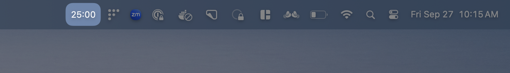
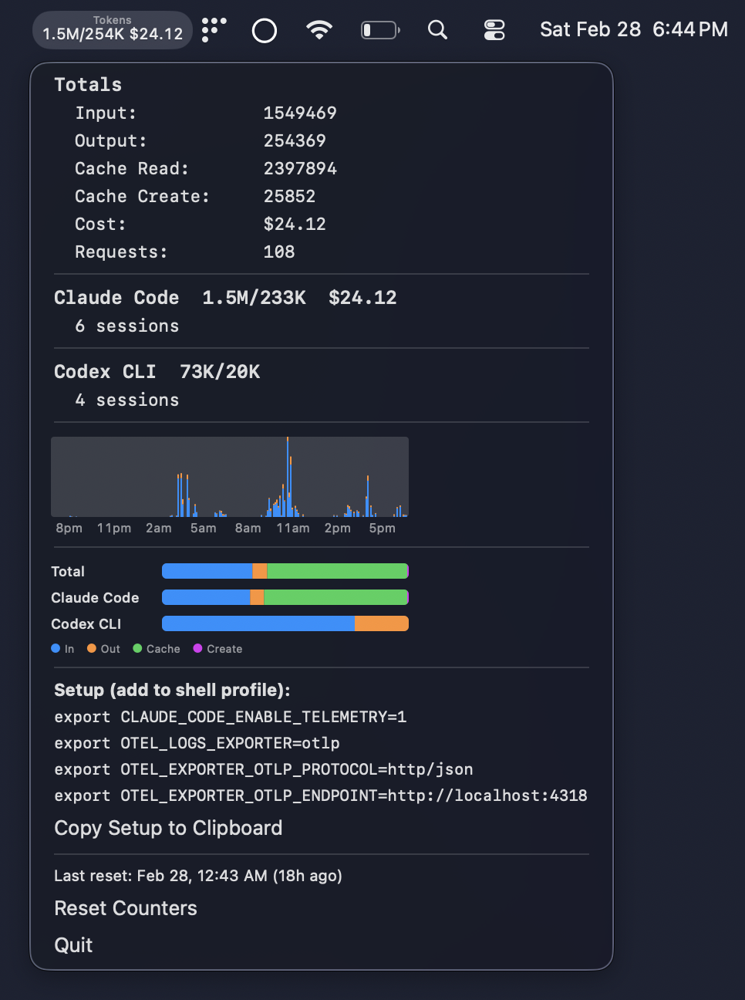

# Onesies
*Joe's collection of onesies. Command line tools, macOS desktop apps, and web-apps. Mostly built with AI.*


### `onesie`  
**_noun_**  /ˈwən-zē/

**Definition:**  
A standalone program written in a single file that performs a specific utility without requiring compilation, external dependencies, or additional setup. A _onesie_ can be copied and run on a new machine as-is, making it ideal for portability and simplicity.

## Philosophy

Each tool in this repository follows a simple principle: **one file, one tool, no dependencies**. Every tool can be installed by copying a single file to your system.

## Featured Tools

### 🍅 Pomodoro Timer

A menu bar Pomodoro timer with customizable durations, color-coded states, and global shortcuts.



**Features:**
- Color-coded states: Gray (stopped) → Green (running) → Orange (warning) → Red (finished)
- Global shortcut (Ctrl+Cmd+P) works system-wide
- Customizable timer duration and warning threshold
- Sound notifications at start/end
- CLI options for testing: `./macos/pomodoro -d 5s -w 2s`

**Usage:**
```bash
# Standard 25-minute timer
./macos/pomodoro

# Custom durations for testing
./macos/pomodoro -d 5s -w 2s        # 5-second timer, 2-second warning
./macos/pomodoro -d 45m -w 5m       # 45-minute timer, 5-minute warning
```

### 📊 Token Counter

A menu bar app that tracks LLM token usage from Claude Code and Codex CLI, with activity charts and cost tracking.



**Features:**
- Counts input/output tokens from Claude Code and OpenAI Codex CLI
- Built-in OpenTelemetry (OTLP) HTTP receiver — no external collector needed
- 24-hour activity timeline at pixel-level resolution
- Token flow breakdown chart (input/output/cache per source)
- Persistent data across restarts
- Counting animation with color flash on new tokens
- Per-source and per-session breakdowns with cost tracking

**Usage:**
```bash
# Start the menu bar app
./macos/token-counter

# It prints the env vars to add to your shell profile:
# export CLAUDE_CODE_ENABLE_TELEMETRY=1
# export OTEL_LOGS_EXPORTER=otlp
# export OTEL_EXPORTER_OTLP_PROTOCOL=http/json
# export OTEL_EXPORTER_OTLP_ENDPOINT=http://localhost:4318
```

## Tool Categories

### 📟 CLI Tools (`cli/`)
Command-line utilities that follow Unix philosophy. Written in shell script or perl.

**Requirements:**
- Must work on Linux and macOS
- Use only standard system programs
- Enable bash strict mode when using bash
- Support both interactive and scripted usage

### 🖥️ macOS Tools (`macos/`)
Desktop applications for macOS written in AppleScript or Swift.

**Requirements:**
- Executable with shebang (`#!/usr/bin/osascript` or `#!/usr/bin/swift`)
- Runnable from terminal
- Handle Ctrl+C gracefully
- No compilation or IDE required

### 🌐 Userscripts (`userscripts/`)
JavaScript snippets for enhancing web pages via browser developer console.

**Requirements:**
- Pure JavaScript (no external dependencies)
- Paste and run in any browser's dev console
- Enhance existing page functionality

## Quick Start

### Installation

Copy any tool file to your system and make it executable:

```bash
# CLI tools
cp cli/toolname ~/bin/toolname
chmod +x ~/bin/toolname

# macOS tools
cp macos/toolname ~/bin/toolname
chmod +x ~/bin/toolname

# Userscripts
# Copy and paste into browser developer console
```

### Examples

```bash
# Try the Pomodoro timer with a 10-second countdown
./macos/pomodoro -d 10s -w 3s

# Run a greeting tool
./cli/hello Alice

# Get help for any tool
./macos/pomodoro --help
```

## Standard Environment

Tools assume these programs are available:
- Shell (bash, sh, zsh)
- Core utilities (grep, sed, awk, cut, sort, uniq, etc.)
- Git
- Perl (bundled with Git)
- Python (system version)
- Standard text editors (vi/vim, nano)

## Contributing

When adding new tools:

1. **One file rule**: Entire tool must be in a single file
2. **No external dependencies**: Use only standard system programs
3. **Cross-platform**: Test on both Linux and macOS
4. **Documentation**: Include usage examples in comments
5. **Error handling**: Handle edge cases gracefully

## Available Tools

### CLI Tools

- **`hello`** - Bash greeting tool with options for uppercase, timestamps, and custom names
- **`hello-perl`** - Perl greeting tool demonstrating POD documentation and core module usage

### macOS Tools

- **`hello`** - AppleScript greeting with dialog interface and argument parsing
- **`hello-swift`** - Native Cocoa app with GUI form, checkboxes, and real-time greeting updates
- **`pomodoro`** - Menu bar Pomodoro timer with color-coded states, global shortcuts, and CLI options for testing
- **`timezones`** - Menu bar multi-timezone display with 2x2 grid layout and customizable timezone list
- **`token-counter`** - Menu bar LLM token counter with activity timeline and token flow charts, built-in OTLP receiver for Claude Code and Codex CLI telemetry

### Userscripts

- **`hello.js`** - Animated browser greeting with floating dialog, customizable options, and auto-dismiss
